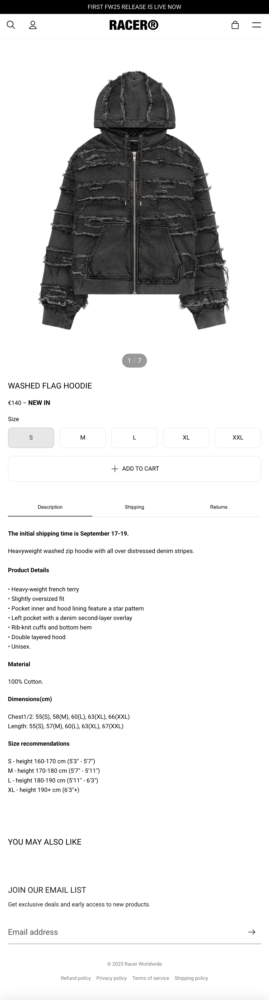

# Procesverslag
Markdown is een simpele manier om HTML te schrijven.  
Markdown cheat cheet: [Hulp bij het schrijven van Markdown](https://github.com/adam-p/markdown-here/wiki/Markdown-Cheatsheet).

Nb. De standaardstructuur en de spartaanse opmaak van de README.md zijn helemaal prima. Het gaat om de inhoud van je procesverslag. Besteedt de tijd voor pracht en praal aan je website.

Nb. Door *open* toe te voegen aan een *details* element kun je deze standaard open zetten. Fijn om dat steeds voor de relevante stuk(ken) te doen.

## Jij

  
uitwerken voor kick-off werkgroep

  ### Auteur:
  Melissa Aksoy
  #### Je startniveau:
  Blauw

  #### Je focus:
  Responsiveness
 

## Je website

  
uitwerken voor kick-off werkgroep

  ### Je opdracht:
  http://racerworldwide.net/?srsltid=AfmBOop-uguB5cYiuFrSWaMYEITb7gluH8r9IgE851nPrr3gIrpE4nNi

  #### Screenshot(s) van de eerste pagina (small screen): 
  Racer Worldwide Homepage  
 

  #### Screenshot(s) van de tweede pagina (small screen):
  Washed Flag Hoodie
  
 

## Toegankelijkheidstest 1/2 (week 1)

  
uitwerken na test in 2e werkgroep

  ### Bevindingen
  
  
  
  
  

  Lijst met je bevindingen die in de test naar voren kwamen:
  - geen duidelijke pagina titels (h1,h2, titels), dit maakt het onduidelijk voor mensen met screenreaders
  - niet semantisch HTML op de homepage
  - geen list items gebruikt waar het moet
  - geen alt text bij image, onduidelijk waar je bent als screenreader gebruiker
  - geen captions of transcripts bij video
  - video is autoplay en kan niet gepauzeerd worden, is niet toegankelijk voor mensen met epilepsie bijvoorbeeld
  - geen dark mode beschikbaar
  

## Breakdownschets (week 1)

  
uitwerken na afloop 3e werkgroep

  ### de hele pagina: 
  

  ### dynamisch deel (bijv menu): 
  

  ### wellicht nog een dynamisch deel (bijv filter): 
  

## Voortgang 1 (week 2)

  
uitwerken voor 1e voortgang

  ### Stand van zaken
  hier dit ging goed & dit was lastig (neem ook screenshots op van delen van je website en code)

  ### Agenda voor meeting
  samen met je groepje opstellen

  | Melissa                   | Noa                  | Joost                                            | Julia         
  | ---                       | ---                  | ---                                              | -tekst naar rechts en 
  | Checken of mijn HTML      |-youtube filmpje.                                                        |links schuiven responsive
                              | moet mijn hele footer|   - kijken naar de                               |- html even goed zien of
                                                     |vormgeving van mijn                               |het klopt 
  | juist is en wat.          |     uitgewerkt       |header en footer                                  
een responsive carousel maken                      |  - een gradient                                  |
  | ik kan verbeteren. als er |                      |  toevoegen op mijn                               |                    
  | tijd is, kijkje naar CSS                        |   images waardoor de tekst beter te lezen is.                 

  ### Verslag van meeting
  hier na afloop snel de uitkomsten van de meeting vastleggen

  - a linkjes binnen li zetten en niet eromheen
  - vragen of ik binnen hamburger menu ook moet uitklappen
  - eerste 2 linkjes geen h2 maar gewoon een a linkje
  - geen h1,h2,h3 etc nodig in linkje
  - video in website is geen img maar <video>, downloaden van website en erin zetten
  - pijltje bij email input als svg in button zetten in de section

## Voortgang 2 (week 3)

  
uitwerken voor 2e voortgang

  ### Stand van zaken
  hier dit ging goed & dit was lastig (neem ook screenshots op van delen van je website en code)

  ### Agenda voor meeting
  samen met je groepje opstellen

  | student 1      | student 2          | student 3    | student 4        |
  | ---            | ---                | ---          | ---              |
  | dit bespreken  | en dit             | en ik dit    | en dan ik dat    |
  | en dat ook nog | dit als er tijd is | nog een punt | dit wil ik zeker |
  | ...            | ...                | ...          | ...              |

1.Mijn youtube filmpje werkt nog niet. Mmag mijn span?
2.hoe maak ik mijn 3e sectie scrollende text
hoe doe ik de img animatie 1e sectie
3.- achtergrond video toegankelijk
- vraag over de header
- text aanpassen met css
4.-hoe maak ik carousel met 3 plaatjes in een grid layout -hoe doe ik aan en uit button op een filmpje - hoe maak ik header transparent - hoe doe ik advertentie in header maar uit de flex layout
 

  ### Verslag van meeting
  hier na afloop snel de uitkomsten van de meeting vastleggen

  - intersection observer
  - header wordt div
  - video autoplay
- ...

## Toegankelijkheidstest 2/2 (week 4)

  
uitwerken na test in 9e werkgroep

  ### Bevindingen
work in progress

## Voortgang 3 (week 4)

  
uitwerken voor 3e voortgang

  ### Stand van zaken
  hier dit ging goed & dit was lastig (neem ook screenshots op van delen van je website en code)

  ### Agenda voor meeting
  samen met je groepje opstellen

  | student 1      | student 2          | student 3    | student 4        |
  | ---            | ---                | ---          | ---              |
  | dit bespreken  | en dit             | en ik dit    | en dan ik dat    |
  | en dat ook nog | dit als er tijd is | nog een punt | dit wil ik zeker |
  | ...            | ...                | ...          | ...              |

1. carousel? button states. video vergroten op mobile first, hero image vergroten op mobile first. toevoegen aan cart image veranderen.
2.plaatje in mn footer naast de tekst
lettertype in mn select aanpassen
3.Is m'n html goed ingesprongen & of ik een hero sectie op de goede manier heb gemaakt

  ### Verslag van meeting
  hier na afloop snel de uitkomsten van de meeting vastleggen

  - pagina 2 html beginnen
  - grid van hero section

## Eindgesprek (week 5)

  
uitwerken voor eindgesprek

  ### Je uitkomst - karakteristiek screenshots:
  

  ### Dit ging goed/Heb ik geleerd: 
  Korte omschrijving met plaatjes

  

  ### Dit was lastig/Is niet gelukt:
  Korte omschrijving met plaatjes

  

## Bronnenlijst

  
continu bijhouden terwijl je werkt

  Nb. Wees specifiek ('css-tricks' als bron is bijv. niet specifiek genoeg). 
  Nb. ChatGpT en andere AI horen er ook bij.
  Nb. Vermeld de bronnen ook in je code.

  1. https://developer.mozilla.org/en-US/docs/Web/CSS
  2. https://chatgpt.com/ verschillende prompts voor het verbeteren van code 
  3. https://uxwing.com/x-social-media-black-icon/
  4. https://uxwing.com/black-instagram-icon/
  5. https://www.racerworldwide.net/?srsltid=AfmBOoqxoiV-sHi5mpR3417ypcRSzhkR2m4ptz1qmCSKuOipmHaIYTKg
  6. https://www.svgrepo.com/svg/333265/play-pause?edit=true
  7. https://www.svgrepo.com/svg/522226/play
  8. https://cssgrid-generator.netlify.app/
  9. https://codepen.io/Tom-Dyer/pen/QwjPQGm
  10. https://www.w3schools.com/tags/ref_pxtoemconversion.asp
  11. https://codepen.io/shooft/pen/MYKjaXd
  12. https://codepen.io/vrsh/pen/myVWJJL?editors=0010

